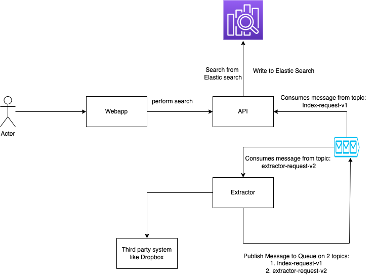

##Requirement

Build a document metadata search system which
1. Connects to a file storage system like Dropbox
2. Extract the file details and store it in a search engine like elastic search
3. Expose an api to search the system based on a keyword and provide the list of matched file
4. API to download the file 

###High Level Design

###Components
1. Webapp: it's a web application, which interacts with the client
2. API: API Component is exposing the API to search based on a keyword from elastic search
3. Extractor: This component is responsible for extracting the data from third party source and pass the data to search system
4. Kafka: This acts as queue for adding metadata required for search and adding details to extract for different folder
5. Elastic search: Used to store the metadata and search

###Assumptions
1. We are not building the OAUTH flow of granting access to the dropbox account and storing the refresh token for offline access.
2. The access token is passed in the application configuration. It's not generated dynamically.
3. No authentication of the user in our system